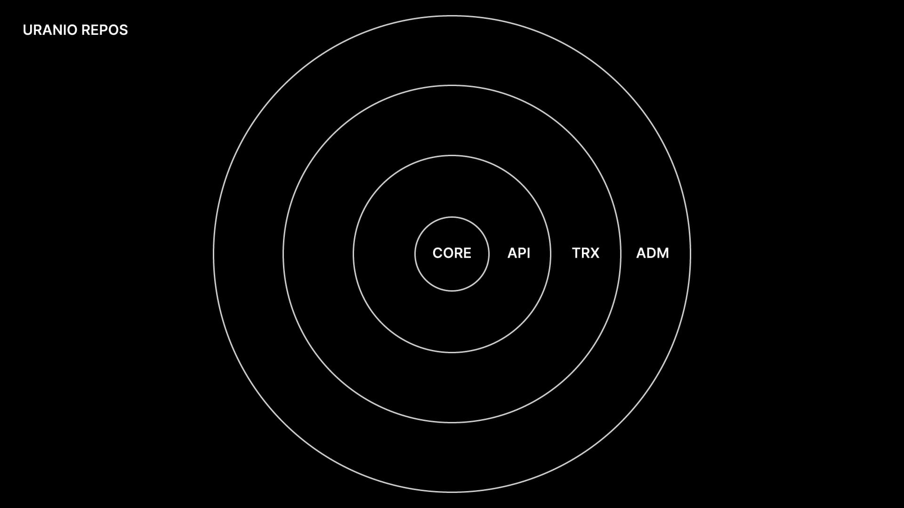

## Uranio CLI

Uranio command line interface.

### Table of Contents

- [About](#about)
- [Installation](#installation)
- [Usage](#usage)
- [Commands](#commands)
- [Getting started](#getting-started)
- [How to develop](#how-to-develop)

### About

**`uranio-cli`** is the only package you need in order to work with Uranio.

Uranio is a framework that builds CRUD APIs.

Uranio can be installed as one of the following repo:
`core`, `api`, `trx`, `adm`.

Each repo includes the previous one.



##### Core

`uranio-core` generates classes needed to interact with the database.

Uranio can interact with the following databases:
[MongoDB](https://www.mongodb.com/)

> More Database will be implemented in the future.

##### Api

`uranio-api` runs a web service that expose a CRUD API.

The web service use [Express.js](https://expressjs.com/) internally.

Uranio API can also be used inside a Lambda Function. It has a method that
creates a service to use inside [Netlify](https://www.netlify.com/) Functions.

```
uranio.api.lambda.create();
```
<!-- Uranio can run the API on [Express.js](https://expressjs.com/) or
on [Netlify](https://www.netlify.com/). -->

##### TRX

`uranio-trx` creates Hooks that can be used to query the API from a client.

> See [Hooks](#hooks)

##### ADM

`uranio-adm` creates a full Administration Panel that interact with the API.


### Installation

Uranio CLI requires [Node.js](https://nodejs.org), version 14 or above.
To install `uranio-cli`, run the following command from any directory
in your terminal:

```bash
yarn global add uranio-cli
```
or if you are using npm
```bash
npm install uranio-cli -g
```

When using the CLI in a CI environment we recommend installing it locally
as a development dependency, instead of globally.
To install locally, run the following command from the root
directory of your project:

```bash
yarn add --dev uranio-cli
```
or if you are using npm
```bash
npm install --save-dev uranio-cli
```

### Usage

Installing the CLI globally provides access to the `uranio` command.

```bash
uranio [command]
```
Run `help` for detailed information about CLI commands
```
uranio help
```

##### Shortcut

```
urn [command]
```

### Commands

#### init

```
uranio init
```

This command initialize the repository. It will download and install all
dependencies and copy all the files needed in order to start developing.

##### Flags

- `-s --root` (*string*) - Set project root.
If empty Uranio will auto detect the closest repo.
- `-r --repo` (*string*) - Set Uranio repo [core, api, trx, adm]
- `-f --force` (*boolean*) - Run without prompts.
- `-p --pacman` (*string*) - Set package manager [npm, yarn]
- `-k --docker` (*boolean*) - Compile and run inside a Docker container -
Docker must be installed on the machine.
- `--docker_db` (*boolean*) - Run a DB in a Docker container -
Docker must be installed on the machine.
- `--db` (*string*) - Set docker DB [mongo] -
Docker must be installed on the machine.


#### dev

```
uranio dev
```
This command starts a local development server.

| Subcommand | description  |
|:------------ |:-----|
| `dev:server` | Run development only for server  |
| `dev:panel` | Run development only for the admin panel  |


#### build

```
uranio build
```
This command build and compiled the code that will be needed in production.

| Subcommand | description  |
|:------------ |:-----|
| `build:server` | Build the server |
| `build:panel` | Build the admin panel  |


#### start

```
uranio start
```
This command starts the server and the admin panel for production.

| Subcommand | description  |
|:------------ |:-----|
| `start:server` | Start the server in production mode |
| `start:panel` | Start the admin panel in production mode  |


#### deinit

```
uranio deinit
```
This command deletes everything uranio created and return the repo in its
initial state.


#### info

```
uranio info
```
This command prints the information uranio was initialized with.


#### help

```
uranio help
```
This command prints the list of all commands, parameters and options.


#### version

```
uranio version

#or

uranio
```
This command prints `uranio-cli` version.


### Output options

- `-v --verbose` (*boolean*) - log in verbose mode.
- `-u --debug` (*boolean*) - log in debug mode.
- `-n --hide` (*boolean*) - do not output log.
- `-b --blank` (*boolean*) - log with no colors.
- `-w --fullwidth` (*boolean*) - log in full width.
- `-x --prefix` (*string*) - set a log prefix.
- `-t --time` (*boolean*) - log with timestamp.
- `-a --context` (*boolean*) - log with context.
- `-l --filelog` (*boolean*) - save log on file.
- `-i --spin` (*boolean*) - log with spinner.
- `-e --native` (*boolean*) - log in native mode.
- `-c --color_log` (*string*) - log color.
- `-o --color_verbose` (*string*) - verbose log color.
- `-q --color_debug` (*string*) - debug log color.


### Getting started

Change directory to your npm repo:

```bash
cd /path/to/my/repo
```

If not already, run:
```bash
yarn init
#or
npm init
```

Then initialize Uranio with:

```bash
uranio init
```

The command will prompt with questions regarding the repository you
want to initialize.

- Choose the package manager [yarn, npm]
- Choose if you want to run and compile inside a Docker container.
- Choose if you want Uranio to create a Docker container with a database.
- If the previous answer was affirmative, choose the database type.
- Choose the uranio module you want to use: [core, api, trx, adm]

This might take a while, depending on your internet connection.

After it is done, your repo is ready for development.

In order to start developing you will need to create and run a development server. Run:

```bash
uranio dev
```
Here you will see all the logs, also it will print the IP of the Admin panel
in the case of the `adm` repo.

Now you can start developing.


### How to develop

The first things that need to be defined in Uranio are `Atoms`.

`Atoms` are the objects stored in the database.

For example if we want to define an `Atom` with the name `product`, we need to
create the directory `src/atoms/product` and the file `src/atoms/prodcut/index.ts`.

The name `product` will be picked from the name of the directory just created.

The `src/atoms/product/index.ts` must export a default object with the `Atom`
definition, like so:

```ts
import uranio from 'uranio';

export default uranio.register.atom({
	properties: {
		title: {
			type: uranio.types.PropertyType.TEXT,
			label: 'Title'
		},
		price: {
			type: uranio.tyoes.PropertyType.FLOAT,
			label: 'Price'
		},
		// ...
	},
	// ...
});
```

Uranio already creates the following required `Atoms`:

##### Core
- superuser
- user
- group
- media

##### Api
- request
- error

##### Admin
- setting

#### Atom register
The parameter of the function `uranio.register.atom` used in `src/atoms/product/index.ts`
is of type:

`uranio.types.Book.Definition`.

```ts
properties: Book.Definition.Properties
plural?: string
authenticate?: boolean
connection?: ConnectionName
security?: Book.Definition.Security
dock?: Book.Definition.Dock
```

A full `Atom` definition would be like this:
```ts
import uranio from 'uranio';

export default uranio.register.atom({
	plural: 'customers',
	authenticate: true,
	security: {
		type: uranio.types.BookSecurityType.UNIFORM,
		_r: uranio.types.BookPermissionType.NOBODY
	},
	connection: 'main',
	properties: {
		full_name: {
			type: uranio.types.PropertyType.TEXT,
			label: 'Full name'
		},
		email: {
			type: uranio.tyoes.PropertyType.EMAIL,
			label: 'Email'
		},
		password: {
			type: uranio.tyoes.PropertyType.ENCRYPTED,
			label: 'Password',
			hidden: true
		},
		groups: {
			type: uranio.tyoes.PropertyType.ATOM,
			label: 'Group',
			atom: 'group',
			optional: true
		},
	},
	dock: {
		url: '/products'
	}
});
```

#### Plural

**`plural`** define the plural word to define the `Atom`.

e.g.: For the `Atom` `product` will be `products`.

#### Authenticate

**`authenticate`** define if the `Atom` is an `AuthAtom`.

> See [AuthAtom]()

`AuthAtom` are `Atom`s that can be authenticated, meaning they have
methods that authenticate with `email` and `password`.

> For example they can be used to define customers.

Uranio already provide 2 `AuthAtom`s: `superuser` and `user`.

#### Connection

**`connection`** define with which connection the `Atom` is stored.

`connection` can be one of the follwing: `main` (default), `log`, `trash`.

Uranio creates 3 database with 3 different connections.

- The `main` connection is where are stored all the main `Atom`s.
- The `log` connection is where are stored the `Atom`s that define logs.
- The `trash` connection is where Uranio put the deleted `Atom`s.

> Uranio API already provide 2 `Atom`s that are used in the `log` connection.
> They are `request` and `error`.
> For each API request an `Atom` `request` is stored.
> For each Uranio error and `Atom` `error` is stored.


#### Security

**`security`** define the security of the `Atom`, meaning how the database can
be queried.

Uranio creates an Access Control Layer (ACL) before querying the database.
This will check if the request can read or write in the database.

Each `Atom` relation can have its own rules.

`security` can be of type:

- `uranio.types.SecurityType.UNIFORM`.
- `uranio.types.SecurityType.GRANULAR`.

Default is `UNIFORM`.

`UNIFORM` permission will check on a relation level, meaning that the rule is
defined for the entire `Atom` relation.

`GRANULAR` permission will check on a Record level, meaning that the rules can
differ between the records. Each record has its own write and read rules.

Each relation / record has two attributes `_r` and `_w`, respectively for reading
and writing permission. The value of these attributes is an `Atom` `group` ID Array.

`_r` will narrow from Everybody

`_w` will widen from Nobody

`_r` == nullish -> Everybody can read

`_w` == nullish -> Nobody can write

For example:
```ts
// src/atoms/product/index.ts

import uranio from 'uranio';

export default uranio.register.atom({
	// ...
	security: {
		type: uranio.types.BookSecurityType.UNIFORM,
		_r: uranio.types.BookPermissionType.NOBODY
	},
	// ...
});
```
The above definition means that Nobody can read or write on the entire `Atom` relation.


```ts
// src/atoms/product/index.ts

import uranio from 'uranio';

export default uranio.register.atom({
	// ...
	security: {
		type: uranio.types.BookSecurityType.UNIFORM,
		_w: uranio.types.BookPermissionType.PUBLIC
	},
	// ...
});
```
The above definition means that Everybody can read and write on the entire `Atom` relation without
authenitcation.

```ts
// src/atoms/product/index.ts

import uranio from 'uranio';

export default uranio.register.atom({
	// ...
	security: {
		type: uranio.types.BookSecurityType.UNIFORM,
		_w: ['61d81a12f3e4ea6edbdcdd1e', '61d81a12f3e4ea6edbwcddff']
	},
	// ...
});
```
The above definition means that Everybody can read but only authenitcated `AuthAtom` that have
groups with the following ids: `['61d81a12f3e4ea6edbdcdd1e', '61d81a12f3e4ea6edbwcddff']`
can write.


```ts
// src/atoms/product/index.ts

import uranio from 'uranio';

export default uranio.register.atom({
	// ...
	security: {
		type: uranio.types.BookSecurityType.GRANULAR,
	},
	// ...
});
```
When the `security` type is `GRANULAR`, the ACL will check if the singles `Atom`s
have the right permission to be read or written.

#### Dock

If **`dock`** property is defined, Uranio will create the CRUD API and expose it
in the web serivce.

`dock` must have a `url` property starting with `/`.

For example:

```ts
// src/atoms/product/index.ts

import uranio from 'uranio';

export default uranio.register.atom({
	// ...
	dock: {
		url: '/products'
	},
	// ...
});
```
will create a route in the webserice `https://[WEBSERVICEURL]/uranio/api/products` where
the `Atom` relation `product` can be queried.

`[WEBSERVICEURL]` can be defined in `uranio.toml`.

`/uranio/api` prefix can be defined in `uranio.toml`.

> See [uranio.toml]() definition

**`dock`** has also the properties `auth_url` that need to be defined when
`authenticate` is equal to `true`.

`auth_url` define the route url where the `AuthAtom` can authenticate.

For example:
```ts
// src/atoms/customer/index.ts

import uranio from 'uranio';

export default uranio.register.atom({
	// ...
	dock: {
		url: '/customers',
		auth_url: '/auth-customer'
	},
	// ...
});
```
will create a route in the webservice `https://[WEBSERVICEURL]/uranio/api/auth-customer`

tha will accept as body in JSON format:
```json
{
	email: 'uranio@email.com',
	password: 'MyPassword1234'
}
```
and will return an `AuthResponse` object with a token and a http-only cookie
if authenitcated.


#### Properties

Type `Book.Definition.Properties` is a list of all the relation key.

Each key is of type `Book.Definition.Property`:

```ts
//type Book.Definition.Property

Property.ID |
Property.Text |
Property.LongText |
Property.Email |
Property.Integer |
Property.Float |
Property.Binary |
Property.Encrypted |
Property.Day |
Property.Time |
Property.SetString |
Property.SetNumber |
Property.EnumString |
Property.EnumNumber |
Property.Atom |
Property.AtomArray;
```

Each property type has the following common properties:

```ts
type: BookPropertyType
label: string
optional?: boolean
hidden?: boolean
unique?: boolean
default?: any
on_error?: (old_value: any) => any
```

`BookPropertyType` can be one of the following

```ts
// BookPropertyType

ID = 'ID',
TEXT = 'TEXT',
LONG_TEXT = 'LONG_TEXT',
EMAIL = 'EMAIL',
INTEGER = 'INTEGER',
FLOAT = 'FLOAT',
BINARY = 'BINARY',
ENCRYPTED = 'ENCRYPTED',
DAY = 'DAY',
TIME = 'TIME',
ENUM_STRING = 'ENUM_STRING',
ENUM_NUMBER = 'ENUM_NUMBER',
SET_STRING = 'SET_STRING',
SET_NUMBER = 'SET_NUMBER',
ATOM = 'ATOM',
ATOM_ARRAY = 'ATOM_ARRAY'
```

